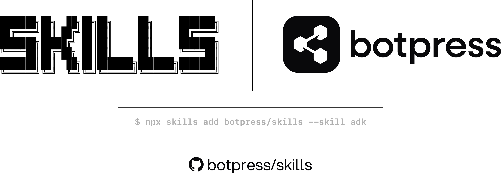

<p align="center">
    <picture>
        <source media="(prefers-color-scheme: dark)" srcset="./assets/dark.png">
        
    </picture>
</p>

# Botpress Skills

A collection of skills for AI coding agents building with Botpress. Skills are packaged instructions and documentation that extend agent capabilities for Botpress development.

Skills follow the [Agent Skills](https://agentskills.io/) format.

## Available Skills

### botpress-adk

Comprehensive documentation and guidelines for building AI agents with the Botpress Agent Development Kit (ADK). A convention-based TypeScript framework where file structure maps directly to bot behavior.

**Use when:**

- Building new features with the Botpress ADK
- Working with Actions, Tools, or Workflows
- Implementing data storage (Tables, Files, Knowledge Bases)
- Using Zai for AI operations (extract, check, label, summarize)
- Configuring integrations or bot settings
- Setting up event-driven triggers
- Need CLI commands or MCP server setup

**Categories covered:**

- **Core Concepts** - Actions (strongly-typed functions), Tools (AI-callable), Workflows (long-running processes), Conversations (message handlers), Triggers (event-driven automation)
- **Data & Content** - Tables (structured storage with semantic search), Files (file storage and management), Knowledge Bases (RAG implementation)
- **AI Features** - Zai (production-ready LLM utility library for common AI operations)
- **Configuration** - Agent config, integration actions, context API, environment variables
- **Development Tools** - CLI reference, MCP server integration, project structure best practices

### botpress-adk-frontend

Production-tested patterns for building frontend applications that integrate with Botpress ADK bots. Covers authentication, type-safe API calls, client management, and type generation workflows.

**Use when:**

- Building a frontend that connects to a Botpress bot
- Implementing authentication with Personal Access Tokens (PATs)
- Setting up the @botpress/client
- Calling bot actions from React/Next.js
- Generating and using TypeScript types from your bot
- Managing client state and caching
- Handling errors and optimistic updates

**Categories covered:**

- **Authentication** - Cookie-based PAT storage, OAuth flow, route protection, token management
- **Client Management** - Zustand store patterns, client caching and reuse, workspace vs bot-scoped clients
- **Type Generation** - Triple-slash references, importing generated types, type-safe action calls
- **Action Calls** - React Query patterns, error handling, optimistic updates, proper typing

**Key technologies:**

- @botpress/client (official TypeScript client)
- TypeScript triple-slash references
- React Query (optional, recommended for mutations)
- Zustand (for client state management)

### botpress-adk-evals

Complete reference for writing, running, and iterating on evals (automated conversation tests) for ADK agents. Covers eval file format, all assertion types, CLI usage, and per-primitive testing patterns.

**Use when:**

- Writing automated tests for an ADK agent
- Learning the eval file format and assertion types
- Running evals and interpreting results
- Testing specific primitives (actions, tools, workflows, conversations, tables)
- Integrating evals into CI pipelines

**Categories covered:**

- **Eval Format** - File structure, turn types, all assertion categories (response, tools, state, tables, workflow, timing)
- **Testing Workflow** - Running evals, interpreting output, using traces, the write-test-iterate loop
- **Test Patterns** - Per-primitive testing patterns for actions, tools, workflows, conversations, tables, and state

### botpress-adk-integrations

Discovering, adding, configuring, and using Botpress integrations in ADK projects. Covers the full integration lifecycle from search to production use.

**Use when:**

- Searching for available integrations
- Adding an integration to an ADK project
- Configuring integration credentials and settings
- Using integration actions, events, and channels in code
- Troubleshooting integration issues

**Categories covered:**

- **Discovery** - `adk search`, `adk list --available`, `adk info` for exploring the integration hub
- **Lifecycle** - End-to-end workflow from search to production use
- **Configuration** - Config types (no-config, OAuth, API key), agent.config.ts setup
- **Common Integrations** - Quick reference for Slack, WhatsApp, Linear, and more

### botpress-adk-docs

Guidelines and commands for creating, reviewing, updating, and maintaining documentation for your ADK bot. Helps you document your own workflows, actions, and features with accurate, searchable guides.

**Use when:**

- Creating documentation for your bot's features and workflows
- Reviewing existing project docs for accuracy and completeness
- Updating docs after changing your bot's code
- Checking if your docs are in sync with implementation
- Searching your project documentation

**Categories covered:**

- **Documentation Standards** - Document types (reference, conceptual, comprehensive), templates, quality checklists
- **Creation** - Research-first workflow for writing docs with verified code examples from your bot
- **Review** - Code accuracy, searchability, completeness, and ADK-specific concerns
- **Maintenance** - Updating, syncing, and searching your project documentation

### botpress-adk-debugger

Systematic debugging for ADK agents. Teaches the AI assistant how to read traces and logs, diagnose common failures, debug LLM behavior issues, and follow a structured debug workflow.

**Use when:**

- Bot isn't responding or behaves unexpectedly
- Tool calls are failing or the wrong tool is selected
- Workflows are stuck or steps aren't executing
- LLM is hallucinating, refusing, or looping
- Build or deploy errors occur
- Need to read and interpret traces or logs
- Debugging config issues (agent.json vs agent.local.json)

**Categories covered:**

- **Traces & Logs** - CLI tools (`adk check`, `adk logs`, `adk traces`, `adk chat`), trace structure, span types, `onTrace` hooks
- **Common Failures** - Runtime failure patterns with symptom-to-fix workflows
- **LLM Debugging** - Wrong tool selection, hallucinated parameters, refusals, looping, reading model reasoning
- **Debug Workflow** - Systematic 8-step loop: validate, reproduce, logs, traces, classify, fix, verify, prevent

## Commands

Commands are thin Claude Code slash commands that load skills. They are the quick entry point - type `/adk-debug` instead of describing what you need.

| Command | What it does |
|---------|-------------|
| `/adk-init` | Scaffold a new ADK project |
| `/adk-debug` | Debug bot issues using traces, logs, and the debug loop |
| `/adk-eval` | Write, run, or debug evals |
| `/adk-frontend` | Build frontend apps that integrate with ADK bots |
| `/adk-integration` | Discover, add, and configure integrations |
| `/adk-doc-create` | Create documentation for a feature in your bot |
| `/adk-doc-review` | Review project docs for accuracy and completeness |
| `/adk-doc-update` | Update project docs after code changes |
| `/adk-doc-sync` | Check if project docs are in sync with your bot's code |
| `/adk-doc-search` | Search your project documentation |

### Installing commands

Install the plugin in Claude Code to get all skills and commands:

```
/plugin marketplace add botpress/botpress-claude-marketplace
/plugin install skills@botpress-marketplace
```

## Installation

```bash
npx skills add botpress/skills --skill adk
```

## Usage

Skills are automatically available once installed. The agent will use them when relevant tasks are detected.

**Examples:**

```
Create an Action that fetches user data
```

```
How do I use Zai to extract structured data?
```

```
Show me how to call my bot's actions from a Next.js frontend
```

```
Set up authentication for my React app with Botpress
```

```
My bot isn't responding — how do I debug this?
```

```
Write an eval that tests my createTicket tool
```

## Skill Structure

Each skill contains:

- `SKILL.md` - Instructions for the agent
- `references/` - Supporting documentation files

```
skills/                       # Heavy knowledge (skills)
├── adk/                      # Core ADK framework (23 reference docs)
│   ├── SKILL.md
│   └── references/
├── adk-frontend/             # Frontend integration (11 reference docs)
│   ├── SKILL.md
│   └── references/
├── adk-evals/                # Testing & evals (3 reference docs)
│   ├── SKILL.md
│   └── references/
├── adk-integrations/         # Integration lifecycle (4 reference docs)
│   ├── SKILL.md
│   └── references/
├── adk-debugger/             # Debugging & observability (4 reference docs)
│   ├── SKILL.md
│   └── references/
└── adk-docs/                 # Documentation management (1 reference doc)
    ├── SKILL.md
    └── references/

commands/                     # Thin slash commands (load skills)
├── adk-init.md               # /adk-init - scaffolding
├── adk-debug.md              # /adk-debug - loads adk-debugger skill
├── adk-eval.md               # /adk-eval - loads adk-evals skill
├── adk-frontend.md           # /adk-frontend - loads adk-frontend skill
├── adk-integration.md        # /adk-integration - loads adk-integrations skill
├── adk-doc-create.md         # /adk-doc-create - loads adk-docs skill
├── adk-doc-review.md         # /adk-doc-review - loads adk-docs skill
├── adk-doc-update.md         # /adk-doc-update - loads adk-docs skill
├── adk-doc-sync.md           # /adk-doc-sync - loads adk-docs skill
└── adk-doc-search.md         # /adk-doc-search - loads adk-docs skill
```

## License

MIT
